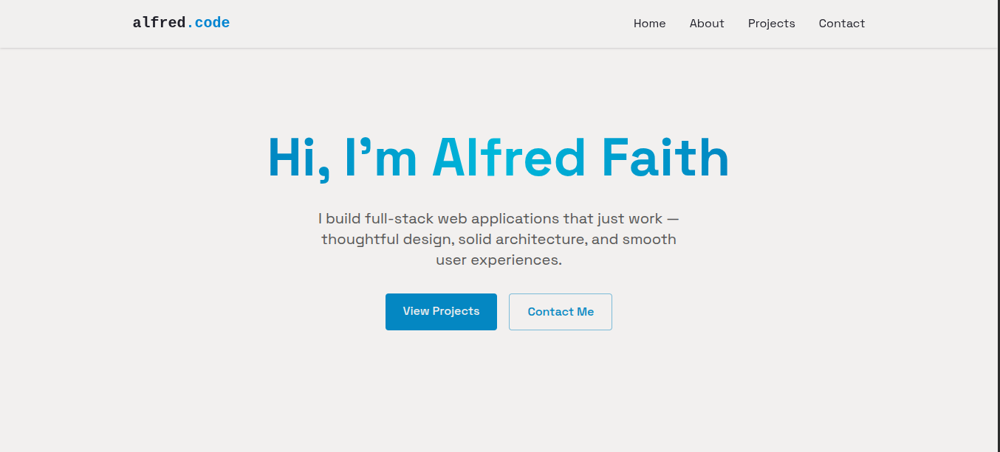

# Modern Portfolio Website — React + TailwindCSS

A fast, responsive, and customizable personal portfolio built with React, Vite, and TailwindCSS. Designed for performance, accessibility, and easy deployment. Includes a client-side contact form powered by EmailJS.

---

## Badges


---

## Table of Contents

- [Overview](#overview)
- [Tech Stack](#tech-stack)
- [Key Features](#key-features)
- [Project Structure](#project-structure)
- [Getting Started](#getting-started)
- [Environment Variables](#environment-variables)
- [Screenshots](#screenshots)
- [Deployment](#deployment)
- [Performance & Accessibility](#performance--accessibility)
- [License](#license)

---

## Overview

This project is a modern portfolio website built with React and TailwindCSS, bundled using Vite for fast development and optimized production builds. It supports light/dark themes, responsive layouts, animated visuals, and a functional contact form using EmailJS without a backend.

---

## Tech Stack

- **React** — Component-based UI
- **Vite** — Fast dev server and build tool
- **TailwindCSS** — Utility-first styling
- **Lucide Icons** — Consistent iconography
- **EmailJS** — Client-side email handling
- **Vercel** — Hosting and CI/CD

---

## Key Features

- **Theme Toggle**

  - Light/Dark mode with persisted preference (localStorage)

- **Responsive UI**

  - Mobile-first layout with adaptive navigation
  - Glassmorphism effects for menus and cards

- **Animated Backgrounds**

  - Subtle motion for visual depth without performance cost

- **Projects Showcase**

  - Project cards with screenshots, tech stack tags, and external links

- **Contact Section**
  - Social links
  - Contact form with EmailJS integration and toast notifications

---

## Project Structure

```text
.
├── src/
│   ├── components/      # Reusable UI components
│   │   ├── sections/          # Page sections (Hero, Projects, Contact)
│   ├── assets/          # Images and static assets
│   ├── App.jsx
│   ├── Index.css
│   └── main.jsx
├── public/
├── index.html
├── tailwind.config.js
├── vite.config.js
└── package.json
```

## Getting Started

### Prerequisites

Node.js (v18+ recommended)
Git

### Development Build

To run this project locally, follow these steps:

- Clone your fork of the repository:

```bash
git clone https://github.com/yourusername/react-tailwind-portfolio.git
```

- Navigate to the project directory

```bash
cd react-tailwind-portfolio
```

- Install dependencies

```bash
npm install
```

- Start the development server

```bash
npm run dev
```

The app will be available at: `http://localhost:5173`

### Production Build

```bash
npm run build
npm run preview
```

## Environment Variables

Create a .env file in the project root:

```js
VITE_EMAILJS_SERVICE_ID = your_service_id;
VITE_EMAILJS_TEMPLATE_ID = your_template_id;
VITE_EMAILJS_PUBLIC_KEY = your_public_key;
```

These are required for the contact form to function correctly.

## Screenshots

Project Showcase:




## Deployment

Vercel

Push the repository to GitHub

Sign in to Vercel

Import the repository

Configure environment variables

Deploy

The site will be hosted at:

`https://your-project-name.vercel.app`

## Performance & Accessibility

- Optimized bundle via Vite

- TailwindCSS purge for minimal CSS output

- Semantic HTML and accessible color contrast

- Responsive images and lazy loading where applicable

## License

This project is licensed under the MIT License. See the [LICENSE](./LICENSE) file for more details. _Let me know if you'd like further modifications! 🚀_

## References

- [React](https://react.dev)

- [TailwindCSS](https://tailwindcss.com)

- [Vite](https://vitejs.dev)

- [Lucide Icons](https://lucide.dev)

- [EmailJS](https://www.emailjs.com)

- [Vercel](https://vercel.com)
